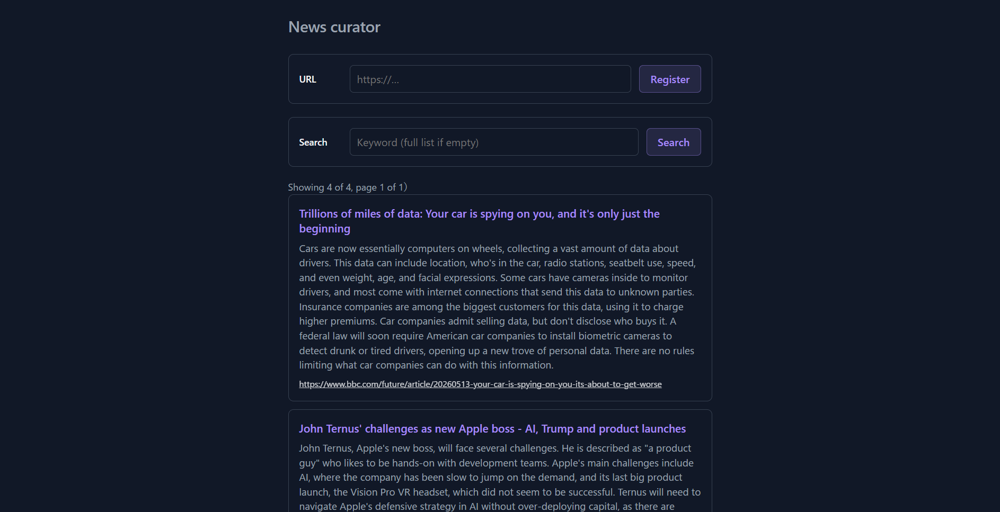
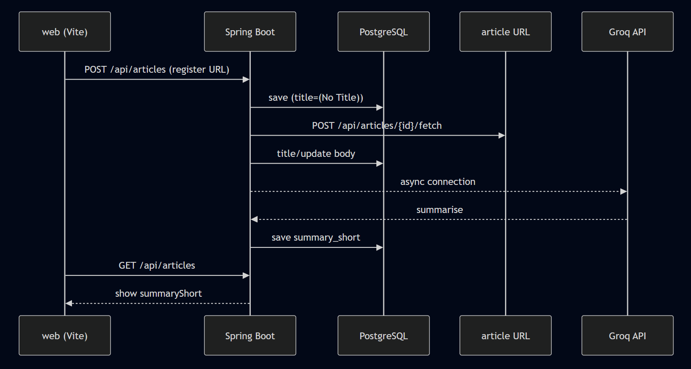

# news-curator

Portfolio project to collect news, search, and summarize by AI for people interested in specific topics like working abroad and nomad work.



## Sequence Diagram



## Implementation

### Repository layout

| Directory | Description |
|-----------|-------------|
| `demo/` | Spring Boot API and PostgreSQL via Docker Compose |
| `web/` | Vite + React frontend |

### Infrastructure and dependencies

**Backend (`demo/`)**

| Component | Role |
|-----------|------|
| Spring Boot 4.0.6 (Java 21) | REST API, JPA, validation |
| Spring Boot Docker Compose | Starts PostgreSQL from `demo/compose.yaml` on `spring-boot:run` |
| PostgreSQL 16 | Article storage |
| Flyway | Schema migrations (`demo/src/main/resources/db/migration/`) |
| Jsoup | HTML fetch and parse (`SimplePageFetcher`) |
| dotenv-java | Loads `demo/.env` at startup (`DemoApplication`) |
| Java HttpClient + Jackson | OpenAI-compatible chat API for summarization (Groq by default) |

**Frontend (`web/`)**

| Component | Role |
|-----------|------|
| Vite + React + TypeScript | UI |
| Zod | Response validation |

**Database migrations**

- `V1__create_articles.sql` — `articles` table
- `V2__create_index_for_GIN.sql` — GIN index for full-text search on `title` and `body`

### Prerequisites

- Windows 10/11 (or equivalent environment)
- Java 21+
- Docker Desktop (with `docker compose` available), running before you start the API
- Node.js (current LTS, e.g. 20.x or newer) and **npm**, if you want to run the `web` frontend
- **Optional — AI summarization:** a [Groq](https://console.groq.com/) API key, or a local [Ollama](https://ollama.com/) instance (OpenAI-compatible endpoint)

### Environment file (`demo/.env`)

Create `demo/.env` from `demo/.env.example` before starting the API. The file is gitignored.

**Always run `spring-boot:run` from `demo/`** so Dotenv and Docker Compose find the right paths.

| Variable | Purpose |
|----------|---------|
| `POSTGRES_DB` | Database name (used by Compose) |
| `POSTGRES_USER` | PostgreSQL user |
| `POSTGRES_PASSWORD` | PostgreSQL password |
| `APP_SUMMARIZATION_ENABLED` | `true` to run AI summaries after fetch; `false` to skip |
| `APP_SUMMARIZATION_API_KEY` | Groq API key (`gsk_...`), or any bearer token your provider expects |
| `APP_SUMMARIZATION_BASE_URL` | OpenAI-compatible base URL (default: Groq) |
| `APP_SUMMARIZATION_MODEL` | Model id (default: `llama-3.1-8b-instant`) |

`DemoApplication` maps `APP_SUMMARIZATION_*` keys to Spring `app.summarization.*` properties. Defaults in `application.properties` keep summarization **disabled** until `.env` overrides them.

**After changing `.env`, restart the API** — values are loaded only at JVM startup.

Example (Groq):

```env
POSTGRES_DB=mydatabase
POSTGRES_USER=myuser
POSTGRES_PASSWORD=secret

APP_SUMMARIZATION_ENABLED=true
APP_SUMMARIZATION_API_KEY=your_groq_api_key_here
APP_SUMMARIZATION_BASE_URL=https://api.groq.com/openai/v1
APP_SUMMARIZATION_MODEL=llama-3.1-8b-instant
```

### AI summarization (Groq setup)

Summarization runs **asynchronously** after a successful **fetch** (see [Article lifecycle](#article-lifecycle)). The UI shows `summaryShort` on the list once it is saved; it may still be empty immediately after fetch.

**1. Groq account and API key**

1. Sign in at [Groq Console](https://console.groq.com/).
2. Create an API key under [API Keys](https://console.groq.com/keys).
3. Put the key in `demo/.env` as `APP_SUMMARIZATION_API_KEY`.
4. Set `APP_SUMMARIZATION_ENABLED=true`.

**2. Start the API and verify Groq (optional)**

From `demo/`:

```powershell
.\mvnw.cmd spring-boot:run
```

Quick Groq check (PowerShell, replace the key):

```powershell
$headers = @{ Authorization = "Bearer YOUR_KEY"; "Content-Type" = "application/json" }
$body = '{"model":"llama-3.1-8b-instant","messages":[{"role":"user","content":"Say hi"}],"max_tokens":10}'
Invoke-RestMethod -Uri "https://api.groq.com/openai/v1/chat/completions" -Method POST -Headers $headers -Body $body
```

**3. End-to-end summarization**

See [Verify startup](#verify-startup). Register → **fetch** → wait a few seconds → list articles again.

**Alternative: Ollama (no Groq account)**

```env
APP_SUMMARIZATION_ENABLED=true
APP_SUMMARIZATION_API_KEY=ollama
APP_SUMMARIZATION_BASE_URL=http://localhost:11434/v1
APP_SUMMARIZATION_MODEL=llama3.2
```

Install Ollama, run `ollama pull llama3.2`, then restart the API.

**Notes**

- Summaries are in **English**, plain text, max 1000 characters (`summary_short` column).
- If Groq returns `Access denied. Please check your network settings.`, try without VPN, another network, or use Ollama locally.

### API reference

Base URL: `http://localhost:8080`

| Method | Path | Description |
|--------|------|-------------|
| `GET` | `/api/health` | Health check → `{"status":"ok"}` |
| `GET` | `/api/articles` | List/search articles (paginated) |
| `POST` | `/api/articles` | Register a URL (does not fetch HTML yet) |
| `POST` | `/api/articles/{id}/fetch` | Fetch HTML, save `title`/`body`, queue AI summary |

**`GET /api/articles`**

| Query param | Default | Description |
|-------------|---------|-------------|
| `q` | (empty) | Full-text search on `title` and `body`; omit for all articles |
| `page` | `0` | Zero-based page index |
| `size` | `20` | Page size (max `100`) |

Response: `{ "content": [...], "totalElements", "totalPages", "number", "size" }`  
Each item: `id`, `url`, `title`, `summaryShort`, `fetchedAt`.

**`POST /api/articles`**

Body: `{ "url": "https://..." }`  
Response `201`: `id`, `url`, `fetchedAt`.  
`409` if the URL is already registered.

**`POST /api/articles/{id}/fetch`**

Fetches the article page, updates the row, and may start async summarization.  
Response `200`: `id`, `url`, `title`, `body`, `summaryShort`, `fetchedAt` (`summaryShort` may still be `null` until the async job finishes).

**PowerShell examples** (run from any directory):

```powershell
# Health
curl -UseBasicParsing http://localhost:8080/api/health

# Register
curl -UseBasicParsing -Method POST -Uri http://localhost:8080/api/articles `
  -ContentType "application/json" -Body '{"url":"https://www.bbc.com/news"}'

# Fetch (replace id)
curl -UseBasicParsing -Method POST -Uri http://localhost:8080/api/articles/1/fetch

# List / search
(Invoke-WebRequest -UseBasicParsing "http://localhost:8080/api/articles?q=Apple").Content
```

### Article lifecycle

The web UI supports **register** and **search** only. **Fetch** and summarization are triggered via the API (or your own client).

```
POST /api/articles          → URL saved; title is "(No Title)" until fetch
POST /api/articles/{id}/fetch → HTML scraped; title/body saved; summary queued (if enabled)
GET  /api/articles          → list shows summaryShort when ready
```

### Search (implementation)

Search uses **PostgreSQL full-text search**, not a simple `LIKE` filter.

- Indexed expression: `to_tsvector('simple', coalesce(title,'') || ' ' || coalesce(body,''))`
- GIN index: `V2__create_index_for_GIN.sql` (same expression as queries)
- Query: `plainto_tsquery('simple', :q)` matched with `@@`
- Sort: `published_at` if set, else `fetched_at` descending

Empty `q` returns all articles (paginated). Search only matches articles that have been **fetched** (non-null `body` contributes to the index).

### Quick start (backend API)

1. Clone this repository.
2. Go to the Spring Boot app: `cd demo`
3. Create your local environment file:
   - Windows: `copy .env.example .env`
   - macOS/Linux: `cp .env.example .env`
4. Edit `.env` — PostgreSQL credentials and, if you want summaries, Groq (or Ollama) settings. See [Environment file](#environment-file-demoenv).
5. Start the app:
   - Windows: `.\mvnw.cmd spring-boot:run`
   - macOS/Linux: `./mvnw spring-boot:run`

Spring Boot Docker Compose integration starts PostgreSQL from `demo/compose.yaml` automatically at startup.

### Quick start (frontend)

The UI talks to the API over HTTP. Start the backend first, then:

1. From the repository root: `cd web`
2. Install dependencies (first time): `npm install`
3. Start the dev server: `npm run dev`
4. Open the URL printed in the terminal (usually `http://localhost:5173`).

Optional: create `web/.env` if the API is not at `http://localhost:8080`:

```env
VITE_API_BASE_URL=http://localhost:8080
```

The backend enables CORS for the default Vite dev origins (`localhost:5173` and `127.0.0.1:5173`); adjust `demo/src/main/java/com/example/demo/WebConfig.java` if you use another port or host.

### Verify startup

**API**

```powershell
curl -UseBasicParsing http://localhost:8080/api/health
```

Expected: `{"status":"ok"}`

Startup logs should include:

- `Container demo-postgres-1 Healthy`
- `HikariPool-1 - Added connection`

**Full flow (with summarization)**

1. Register a URL: `POST /api/articles`
2. Fetch content: `POST /api/articles/{id}/fetch`
3. Wait **10–30 seconds** for async summarization
4. List articles: `GET /api/articles` or search in the UI — `summaryShort` should contain an English summary

**Frontend**

With `npm run dev` running, try register and search. To see a summary in the UI, complete the fetch step via API first. Use the browser **Network** tab if requests fail.

### Local services

| Service | URL / host |
|---------|------------|
| API | `http://localhost:8080` |
| PostgreSQL | `localhost:5432` (credentials from `demo/.env`) |
| Vite dev server | typically `http://localhost:5173` |

**PostgreSQL shell** (must run from `demo/`):

```powershell
cd demo
docker compose exec postgres psql -U myuser -d mydatabase
```

### Production build (frontend)

From `web/`:

- `npm run build` — output in `web/dist/`

Serve `dist/` with any static host; configure that host and CORS (or a reverse proxy to the API) for your deployment.

### Troubleshooting

**Docker / Compose**

- `docker` not found — install and start Docker Desktop before `spring-boot:run`.
- `no configuration file provided: not found` — run `docker compose` from **`demo/`**, not the repository root.
- Port `5432` or `8080` in use — stop the conflicting process or container.

**API / shell**

- PowerShell `curl` warnings — use `-UseBasicParsing` or `Invoke-RestMethod`.
- `npm` / `node` not found — install Node.js LTS and reopen the terminal.

**CORS**

- Browser CORS errors — match the frontend origin in `WebConfig`, or proxy API and UI on the same origin.

**Articles and summaries**

| Symptom | What to check |
|---------|----------------|
| Title shows `(No Title)`, summary `—` | Run `POST /api/articles/{id}/fetch`; register alone does not scrape the page. |
| `summaryShort` stays `null` after fetch | `APP_SUMMARIZATION_ENABLED=true` and API key set in `demo/.env`; **restart** the API after editing `.env`. |
| Still no summary | API logs for `Summarization failed`; test Groq from PowerShell (see [AI summarization](#ai-summarization-groq-setup)). |
| Groq `Access denied. Please check your network settings.` | VPN, corporate network, or region; try another network or [Ollama](#ai-summarization-groq-setup). |
| Re-fetch does not refresh summary | If `body` unchanged and a summary already exists, it is kept; clear `summary_short` in DB or use a new URL to re-summarize. |

**Search**

- No results for a keyword — article may not be fetched yet (`body` empty), or the term is not in `title`/`body`.
